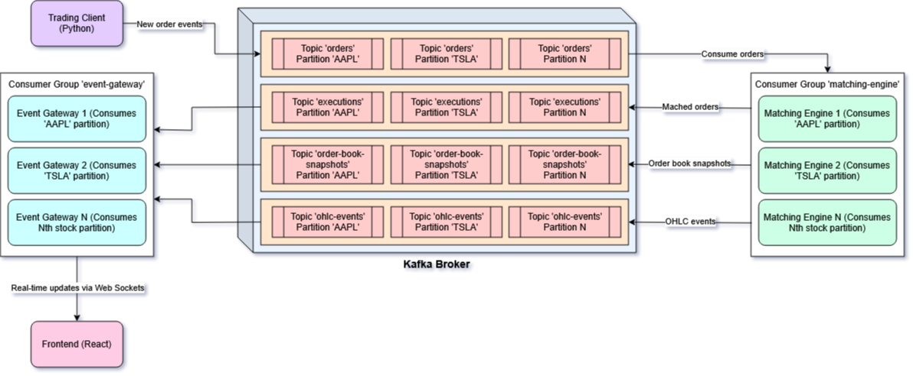

# Real-time Order Book Simulator

A real-time order book system simulating matching logic for various order types, such as limit, market, and cancel orders.

## Tech Stack

- **Frontend:** React, TypeScript
- **Backend Services:** Java (Matching Engine), Python (Trading Client), Node.js (Event Gateway)
- **Streaming & Messaging:** Apache Kafka
- **Real-Time Communication:** WebSockets
- **Containerization:** Docker, Docker Compose
- **Build Tools:** Maven (Java), npm (Node.js), pip (Python)


---

## Features

- Real-Time Order Processing: Efficient handling of Market, Limit, and Cancel orders using Apache Kafka for distributed, load-balanced communication.
- Live Candlestick Charts: Dynamic OHLC visualization driven by real-time data streamed from the matching engine.
- Order Book Snapshots with Key Metrics: Includes spread, best bid/ask, liquidity ratio, and total volume for enhanced market insight.
- Thread-Safe Engine: Robust multi-threading ensures order book snapshots remain consistent during active order processing.
- Dockerized Deployment: Fully containerized with Docker Compose for consistent setup across any operating system.
- Smart Trade Simulation: The trading client generates realistic market activity using Gaussian distributions, volatility modeling, and directional drift.

---

## Architecture Diagram



---

## Getting Started

### 1. Clone the Repository
```bash
> git clone https://github.com/Tarrin376/Real-time-Order-Book-Simulator.git
> cd Real-time-Order-Book-Simulator
```

### 2. Spin up the Kafka Docker containers
```bash
# Builds the images and runs two Kafka containers: One for the broker and the other one for the Control Center for insight into data flow
> docker-compose -f docker-compose.kafka.yml up -d --build
# Verify that you see the two Kafka containers running
> docker ps
```

### 3. Configure the Kafka Topics Through Confluent Control Center

1. Open [Confluent Control Center](http://localhost:9021).
2. Click on the single running cluster and navigate to **Topics**.
3. Click **"New Topic"** — you should see a screen similar to the one below:

   

4. Create the following four topics:
   - `orders`
   - `order-book-snapshots`
   - `executions`
   - `ohlc-events`

5. For each topic, follow these steps:
   - Enter the topic name (use one of the names listed above).
   - Set **Number of partitions** to `4`  
     *(Each partition corresponds to a security, e.g., TSLA, META, AAPL, GOOG).*
   - Click **"Customize settings"**.
   - Set **Availability** to `Low availability` *(recommended for local development)*.
   - Set **Storage retention time** to `1 hour`  
     *(Events older than this will be automatically deleted).*

6. Wait until all topics are in a healthy state. You should see something like this:

   

### 4a. Running the application (using Docker)
```bash
# Creates a shared network called 'order_book_network' which will be used by the Kafka and application containers
> docker network create order_book_network
# Builds the images and runs four containers: Matching Engine, Event Gateway, Trading Client, and Frontend
> docker-compose -f docker-compose.yml up -d --build
# Run again to check that you see four more containers running
> docker ps
```

### 4b. Running the application (without Docker)
```bash
# Move to the Frontend directory
> cd frontend
# Install all necessary dependencies
> npm install
# Run the Vite web app
> npm run dev

# Move to the Matching Engine directory
> cd ../matching-engine
# Compile the code
> mvn clean package
# Run the .jar file produced
> java -jar target/matching-engine-1.0-SNAPSHOT.jar

# Move to the Trading Client directory
> cd ../trading-client
# Create a virtual environment and activate it (optional)
> virtualenv venv_name
> ./venv/Scripts/activate
# Install all necessary Python packages contained within the requirements.txt file
> pip install -r requirements.txt
# Run the Trading Client
> python main.py

# Move to the Event Gateway directory
> cd ../event-gateway
# Install all necessary dependencies
> npm install
# Run the Event Gateway
> npm run dev
```

### 5. Open [Frontend](http://localhost:9000) and you should see the application running live! 
- Give it a few seconds to establish WebSocket connections, Kafka broker connections, etc.

